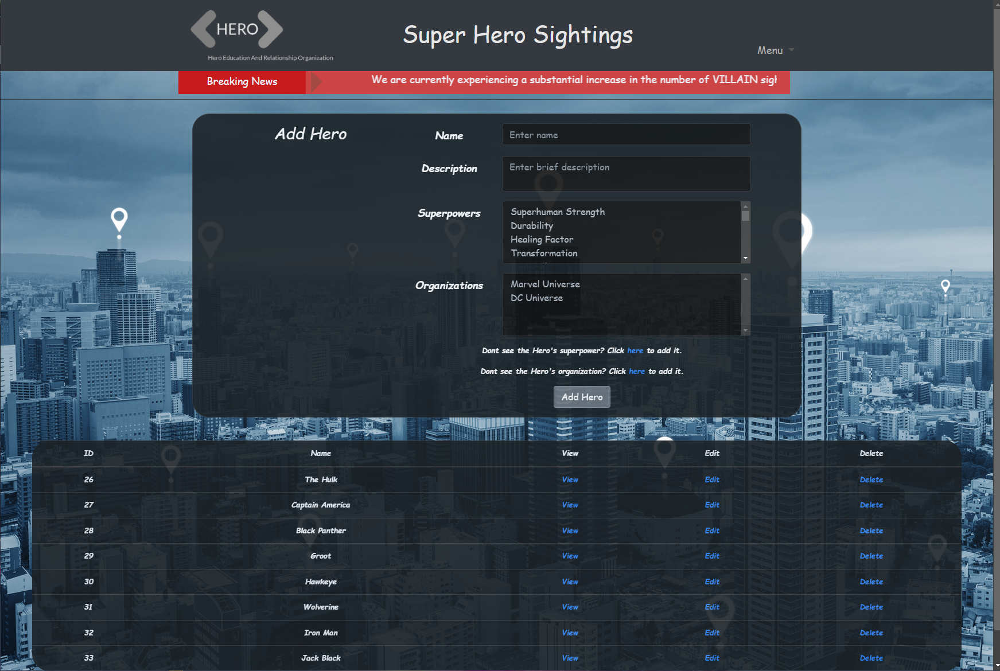

# Superhero Sightings
       
                                         
Full-stack Java/Spring Boot web application with server-side rendered UI using Thymeleaf. Data persistence to/from MySQL database using JDBC Template.

Allows users to view and report sightings using CRUD operations. 

Includes:

Wireframes for building the user interface and Entity Relationship Diagrams for relational database planning.

MySQL scripts for building main MySQL database and the test database.

Technologies Used:

